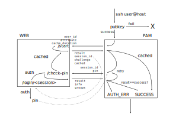

# PAM-WebSSO protocol

## Functional

The Pam-WebSSO system is meant for the case in which a server admins want to allow users to log in to their server based on authentication in a web browser.  This can be used in place of or in addition to regular means of terminal-based authentication, such as ssh public keys or username/password.  It can also be used to enable use of advanced multi-factor authentication methods which would otherwise be unavailable or hard to use on terminal-based systems.

Functionally, the user connects to the system in the regular fashion.  The system than shows a url the the users needs to visit in their web browser; this web site can implement any form of authentication desired.  Once the user is authenticated, their can continue logging in the the terminal by entering the pin code presented by the web site.

## Overview
The picture below gives a schematic overview of the PAM-WebSSO protocol:



The flow is as follows (more details below):
1. User logs in to a terminal application (e.g., using ssh)
1. SSH starts PAM-WebSSO module
1. Pam-WebSSO initiates a backend call to the WebSSO-server (e.g., `https://websso.server/req` endpoint).  It sends the incoming `username` and receives a `session_id`, a `challenge_url` and a `sso_freshness`.
1. based on the `sso_freshness`, the PAM module can decide to accept the connection right away
1. If not, the pam module presents the `challenge_url` to the user and prompt for a pin
1. The user copies the `challenge_url` (e.g., `https://websso.server/login/session`) to their browser.
1. The WebSSO-server asks the user to log in (using local accounts, OIDC, etc).
1. If the user has successfully authenticated, the WebSSO server checks if the known (registered) username of this user matches the username that was provided to the `/req` endpoint.
1. If everything checks out, the WebSSO-server generates a pin and presents it to the user.
1. The user enters the pin in the terminal
1. The pam module initiates a new backend call to the WebSSO server; it send the users `sessions` and their entered `pin`; the WebSSO server verifies the pin and responds with a status code.
1. Based on the status code, the pam module allows the user to log in, or denies access.

## API description
The WebSSO server need to implement two API endpoints and a user interface: the request endpoint, the authentication endpoint and the authentication UI.

Authentication to the API is managed via a bearer token.

The full API specification is available as an [OpenAPI file](websso-api.yml).

### Request start endpoint
To initiate a request, send a request to the `/start` endpoint with a json body.  The json object should have three members:
  - `user_id`: the identifier of the user who is trying to log in
  - `attribute`: the attribute or claim from the web authentication process to which the `user_id` should be matched (e.g., `email`, `sub` (for OIDC) or `urn:oasis:names:tc:SAML:attribute:subject-id` for SAML2)
  - `cache_duration`: the duration (in seconds) during which a previous login of the same user should be considered valid, and during which the user does not need to authenticate in the web browser again.

The response consists of a json object with the following members:
  - `result`: should always be "OK"
  - `session_id`: identifier to refer to this login sessions later on (specifically, when querying the `/check-pin` API)
  - `challenge`: challenge to show to the user; this includes a URL which the user should visit to authenticate
  - `cached`: whether or not the user has already successfully authenticated in the previous `cache_duration` seconds

Example:
```json
{
  "user_id": "jan.klaassen@uni-harderwijk.nl",
  "attribute": "email",
  "cache_duration": 60
}
```
Reponse:
```json
{
  "result": "OK",
  "session_id": "39277014-1824-4F7A-93EE-8E2FBAA1E816",
  "challenge": "To continue, please visit https://localhost:3000/pam-websso/login/39277014-1824-4F7A-93EE-8E2FBAA1E816 and enter pin below",
  "cached": false
}
```

### Authentication UI
The authentication UI corresponds to the challenge url in the response above.
It should allow the user to log in, and when they have logged in, show a PIN number to be entered in their terminal.

How authentication is managed, is implementation dependent.  The server could simply have a local database, could implement social logins (Google, Apple) or use external authentication from an identity federation based on OpenID Connect or SAML2.

### Check pin endpoint
To check an entered pin, send a request to the `/check-pin` endpoint with the following members:
  - `session_id`: id of the authentication session, as returned by the `/start` endpoint
  - `pin`: pin as entered by the user

The response is a json with the following members:
  - `result`: either `SUCCESS` if the pin was correct and the user has authenticated successfully, `TIMEOUT` if the user failed to authenticate in a reasonable time frame, or `FAIL` if the pin is incorrect or the authenticated user didn't match the pam user.
  - `debug_msg`: message explaining what has happened.  Not meant to show to the end user.

Example:
```json
{
  "session_id": "39277014-1824-4F7A-93EE-8E2FBAA1E816",
  "pin": "1234"
}
```

Response:
```json
{
  "result": "SUCCESS",
  "debug_msg": "Authenticated on attribute 'email'"
}
```
